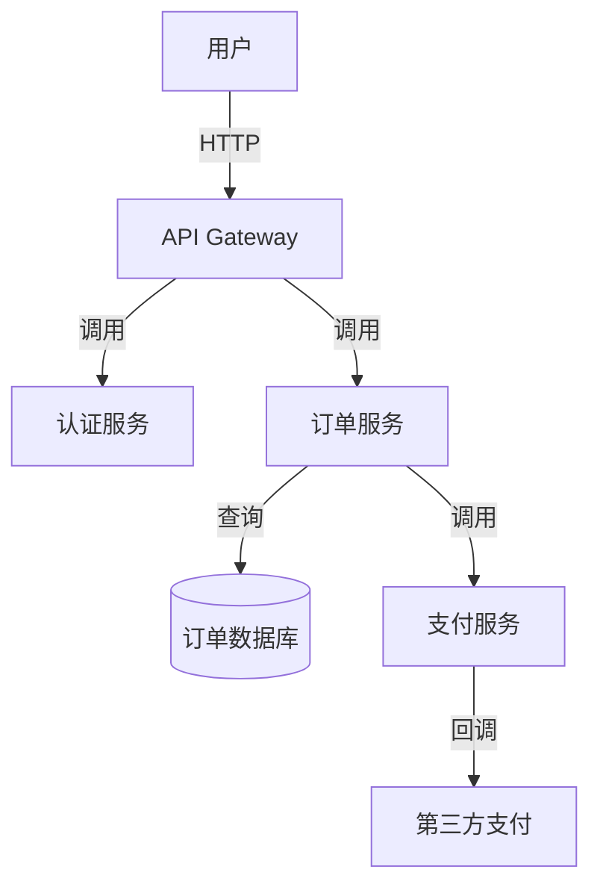

# SDLC-skill v1.2 优化设计文档

> **设计目标**：补齐 SDLC-skill v1.1 在全生命周期覆盖度上的短板，提升"设计→交付物"的闭环能力，增强生产就绪支持。
>
> **设计日期**：2026-04-28
> **设计版本**：v1.0
> **作者**：Claude Code + 用户协作

---

## 1. 背景与问题陈述

SDLC-skill v1.1 在需求分析和架构设计阶段表现优秀（三层 XML 体系、动态模式筛选、领域扩展），但在以下方面存在明显断层：

1. **设计→交付物断层**：`architecture.xml` 定义了 `DataModel` 和 `Interface`，但没有自动转换为工程可用文件（SQL DDL、OpenAPI YAML）
2. **测试覆盖率缺失**：CI/CD 配置中缺少覆盖率检查，无法量化测试质量
3. **可视化能力空白**：没有架构图、时序图、ER 图等可视化输出
4. **生产就绪不足**：仅有基础 docker-compose.yml，缺少 Terraform、监控、多环境部署
5. **开发者体验不完善**：没有 Bug 定位、重构建议、需求追溯矩阵等进阶功能

---

## 2. 总体方案：分层混合（Hybrid）

采用"核心增强 + 独立扩展"的分层策略：

| 批次 | 策略 | 优化项 | 形态 |
|------|------|--------|------|
| **P0（第一波）** | **融入核心** | 数据库 Schema 生成、OpenAPI 生成、测试覆盖率集成 | 修改现有 skill |
| **P1（第二波）** | **新增独立 skill** | 架构可视化、IaC + 监控 + 多环境部署 | 新建 skill |
| **P2（第三波）** | **后续迭代** | Bug 定位、重构建议、需求追溯矩阵 | v1.2+ 规划 |

---

## 3. 第一波 (P0)：核心 Skill 交付物增强

### 3.1 改动 1：sdlc-architecture-design 新增输出节点

在现有工作流第 9 步（XML architecture modeling）之后，新增第 10、11 步。

#### 第 10 步：DataModel → SQL DDL 生成

**输入**：`skill/artifacts/architecture.xml` 中的 `DataModel` 节点

**处理逻辑**：
1. 遍历每个 `DataModel` 节点，提取 `name`、`Fields`、`CacheStrategy`
2. 将 `Fields/Field` 转换为 SQL 列定义：
   - `name` → 列名
   - `type` → SQL 类型（需要类型映射表：string→VARCHAR、int→INT、datetime→TIMESTAMP 等）
   - `required="true"` → NOT NULL
   - `default` → DEFAULT 值
   - `unique="true"` → UNIQUE 约束
3. 推断主键（优先取名为 `id` 的字段，否则取第一个 `required="true"` 字段）
4. 推断索引（`CacheStrategy/indexedFields` 或频繁查询字段）
5. 推断外键（通过 `Coupling` 关系推断，标记为 `REFERENCES`）
6. 输出 `skill/artifacts/schema.sql`

**同时输出**：`skill/artifacts/ERD.md`
- 使用 Mermaid `erDiagram` 语法
- 每个 `DataModel` 为一个实体
- `Coupling` 关系转换为实体间关系线（1:1、1:N、N:M）

#### 第 11 步：Interface Contract → OpenAPI 生成

**输入**：`skill/artifacts/INTERFACE_CONTRACT.md` + `architecture.xml` 中的 `Module/Interface`

**处理逻辑**：
1. 解析 INTERFACE_CONTRACT.md 中的接口表格
2. 转换为 OpenAPI 3.0 格式：
   - `method name` → `paths/{endpoint}/{method}`
   - `input schema` → `requestBody/content/application/json/schema`
   - `output schema` → `responses/200/content/application/json/schema`
   - `error codes` → `responses/{code}/description`
3. Schema 定义复用 `DataModel` 的 `Fields` 定义，生成 `#/components/schemas/{DataModelName}`
4. 输出 `skill/artifacts/openapi.yaml`

**OpenAPI 文件结构**：
```yaml
openapi: 3.0.0
info:
  title: [Project Name] API
  version: 1.0.0
paths:
  /api/v1/{module}/{endpoint}:
    post:
      summary: [method name]
      requestBody:
        content:
          application/json:
            schema:
              $ref: '#/components/schemas/[InputSchema]'
      responses:
        '200':
          description: Success
          content:
            application/json:
              schema:
                $ref: '#/components/schemas/[OutputSchema]'
        '4xx':
          description: [error description]
components:
  schemas:
    [DataModelName]:
      type: object
      properties:
        ...
```

### 3.2 改动 2：sdlc-project-scaffolding CI/CD 覆盖率增强

在现有第 7 步（CI/CD pipeline）中，测试 job 增加覆盖率检查。

**具体修改**：

```yaml
# .github/workflows/ci.yml 片段
jobs:
  test:
    runs-on: ubuntu-latest
    steps:
      - uses: actions/checkout@v3
      - name: Install dependencies
        run: pip install -r requirements.txt pytest pytest-cov
      - name: Run tests with coverage
        run: pytest --cov=src --cov-report=xml --cov-report=term --cov-fail-under=80
      - name: Upload coverage report
        uses: codecov/codecov-action@v3
        with:
          files: ./coverage.xml
          fail_ci_if_error: true
```

**阈值策略**：
- 默认阈值：80%（行覆盖率）
- 如果用户要求，可调整（P0 阶段固定 80%，P2 可配置）

**同步规则更新**：

在 `docs/sync-rules.md` 中增加：

| 代码变更类型 | 需要同步的文档 |
|-------------|---------------|
| `DataModel` 字段变更 | `schema.sql` + `openapi.yaml` + `ERD.md` |
| 接口签名变更 | `openapi.yaml` + `INTERFACE_CONTRACT.md` |
| 新增错误码 | `openapi.yaml` + 所有相关 `ErrorHandling` 节点 |

### 3.3 XML Schema 扩展

`references/xml-schemas.md` 中 `DataModel` 节点增加以下可选属性：

```xml
<DataModel name="User" ddlType="table" tableEngine="InnoDB">
  <Fields>
    <Field name="id" type="uuid" required="true" primaryKey="true" />
    <Field name="email" type="string" length="255" required="true" unique="true" index="true" />
    <Field name="created_at" type="datetime" required="true" default="CURRENT_TIMESTAMP" />
  </Fields>
  <CacheStrategy type="redis" ttl="3600" indexedFields="email" />
  <Relationships>
    <Relationship type="one-to-many" target="Order" foreignKey="user_id" />
  </Relationships>
</DataModel>
```

新增 `Relationships` 子节点用于显式定义外键关系（避免仅靠 `Coupling` 推断的模糊性）。

---

## 4. 第二波 (P1)：新增独立 Skill

### 4.1 新增 Skill：sdlc-visualization（架构可视化）

#### 触发条件
- 用户输入 `[VISUALIZE]` 或 "生成架构图"
- `sdlc-architecture-design` 完成后自动建议（可选）

#### 输入
- `skill/artifacts/architecture.xml`（系统级）
- `skill/artifacts/modules/{id}/module-architecture.xml`（模块级，如有）

#### 输出
- `docs/architecture/diagrams/system-context.mmd` — 系统上下文图
- `docs/architecture/diagrams/module-interaction.mmd` — 模块交互时序图
- `docs/architecture/diagrams/data-flow.mmd` — 数据流图
- `docs/architecture/diagrams/er-diagram.mmd` — ER 图

#### 工作流

1. **解析 XML**
   - 读取 `architecture.xml` 的 `Module`、`Coupling`、`Interface`、`DataModel` 节点
   - 构建模块依赖图（有向图）

2. **生成系统上下文图**
   - Mermaid `graph TD` 语法
   - 展示系统与外部依赖（用户、第三方服务、数据库）的交互

3. **生成模块交互时序图**
   - Mermaid `sequenceDiagram` 语法
   - 选择一条核心用户故事，展示模块间的调用时序

4. **生成数据流图**
   - Mermaid `graph LR` 语法
   - 展示数据在模块间的流转路径

5. **生成 ER 图**
   - Mermaid `erDiagram` 语法
   - 从 `DataModel` 和 `Relationships` 生成

#### VCMF Checkpoints

| 原则 | 检查点 |
|------|--------|
| Design as Contract | 图表必须与 `architecture.xml` 完全一致，不得添加未定义的模块或接口 |
| Interface as Boundary | 时序图中的消息必须与 `Interface` 定义匹配 |
| Reality as Baseline | ER 图中的关系必须有 `Relationships` 节点或 `Coupling` 支持 |

#### 示例输出



### 4.2 新增 Skill：sdlc-ops-ready（生产就绪基础设施）

#### 触发条件
- 用户输入 `[OPS]` 或 "生成部署配置"
- `sdlc-project-scaffolding` 完成后可用

#### 输入
- `skill/artifacts/architecture.xml`
- `skill/artifacts/PROJECT_SCAFFOLD/`
- 用户指定的云平台（AWS / Azure / GCP / 私有云）

#### 输出

```
infrastructure/
├── terraform/
│   ├── main.tf
│   ├── variables.tf
│   ├── outputs.tf
│   └── modules/
│       ├── network/        # VPC、子网、安全组
│       ├── compute/        # ECS/EKS/AKS/GKE
│       ├── database/       # RDS/Cloud SQL/Aurora
│       └── cache/          # Redis/ElastiCache
├── kubernetes/
│   ├── base/               # Kustomize base
│   │   ├── deployment.yaml
│   │   ├── service.yaml
│   │   ├── ingress.yaml
│   │   └── hpa.yaml        # Horizontal Pod Autoscaler
│   └── overlays/
│       ├── dev/
│       ├── staging/
│       └── prod/
├── monitoring/
│   ├── prometheus/
│   │   └── rules.yml       # 告警规则
│   └── grafana/
│       └── dashboards/
│           └── system.json # 仪表盘
└── docs/
    └── runbook.md          # 运维手册
```

#### 工作流

1. **资源需求推断**
   - 根据 `Module` 数量和 `StateModel` 推断需要的计算/存储/缓存资源
   - 根据 `Security` 节点推断网络隔离需求

2. **Terraform 生成**
   - 按模块分层：network → database → cache → compute
   - 每个 `Module` 对应一个 K8s deployment
   - 支持多 workspace 管理多环境

3. **K8s Manifests 生成**
   - 使用 Kustomize 管理环境差异
   - 每个模块一个 deployment + service
   - Ingress 按模块接口聚合
   - HPA 基于 CPU/内存阈值自动扩缩容

4. **监控配置生成**
   - 基于 `Interface` 定义自动生成 RED 指标：
     - **R**ate：请求速率
     - **E**rrors：错误率（基于 `ErrorHandling` 定义的错误码）
     - **D**uration：响应延迟
   - Prometheus rules 按模块分文件
   - Grafana dashboard 自动生成模块级面板

5. **运维手册生成**
   - 部署步骤（ Terraform apply 顺序）
   - 回滚流程（ `terraform plan` 对比 + 备份策略）
   - 告警响应（每个告警规则的排查步骤）
   - 扩容指南（何时触发 HPA、何时升级节点）

#### VCMF Checkpoints

| 原则 | 检查点 |
|------|--------|
| Design as Contract | Terraform 资源必须与 `Module` 一一对应，不得凭空创建资源 |
| Interface as Boundary | K8s service 端口必须与 `Interface` 定义匹配 |
| Reality as Baseline | 监控指标必须可采集（不过度设计） |
| State as Responsibility | 数据库和缓存的持久化策略必须与 `StateModel` 一致 |

#### 云平台抽象

通过 `references/` 目录提供云平台特定模板：

```
sdlc-ops-ready/
├── SKILL.md
└── references/
    ├── aws-modules.md       # AWS 特定资源映射
    ├── azure-modules.md     # Azure 特定资源映射
    ├── gcp-modules.md       # GCP 特定资源映射
    └── k8s-best-practices.md # K8s 通用最佳实践
```

用户选择云平台后，动态加载对应模板。

---

## 5. 第三波 (P2)：后续迭代规划（v1.2+）

P2 优化项不在当前实施范围内，但预留设计位置：

| 优化项 | 形态 | 触发时机 | 依赖 |
|--------|------|----------|------|
| Bug 定位与修复建议 | `sdlc-debug-assistant` skill | 测试失败 / 异常日志 | 需要已有代码和测试 |
| 代码重构建议 | 同上 skill 的子功能 | 代码审查 / 设计审查 | 需要已有代码 |
| 需求追溯矩阵 (RTM) | 扩展 `sdlc-requirement-analysis` | PRD 生成时自动输出 | 无 |
| 多环境部署策略 | 扩展 `sdlc-ops-ready` | 用户需要蓝绿/金丝雀发布 | 需要 P1 完成 |

---

## 6. 实施顺序与依赖

```
Phase 1: P0 实施
├── 1.1 更新 references/xml-schemas.md（增加 Relationships 节点）
├── 1.2 更新 sdlc-architecture-design/SKILL.md（第 10、11 步）
├── 1.3 更新 sdlc-project-scaffolding/SKILL.md（覆盖率 CI）
├── 1.4 更新 docs/sync-rules.md（同步规则扩展）
└── 1.5 P0 验证：跑一轮完整 SDLC 流程，确认 schema.sql + openapi.yaml + 覆盖率报告正常产出

Phase 2: P1 实施
├── 2.1 创建 sdlc-visualization/SKILL.md
├── 2.2 创建 sdlc-ops-ready/SKILL.md
├── 2.3 创建 sdlc-ops-ready/references/（云平台模板）
├── 2.4 更新根目录 SKILL.md（注册新 skill）
└── 2.5 P1 验证：与 P0 联动测试，确认可视化图表和 Ops 配置正确生成

Phase 3: P2 规划
└── 3.1 编写 v1.2 路线图文档（ROADMAP.md）
```

---

## 7. 风险评估

| 风险 | 影响 | 缓解措施 |
|------|------|----------|
| XML Schema 扩展破坏向后兼容 | 高 | 所有新增属性均为 optional，不修改现有必填约束 |
| DDL 类型映射不准确 | 中 | 提供常见类型映射表，复杂类型 fallback 为 TEXT |
| OpenAPI 生成与手工维护冲突 | 中 | 明确标注"自动生成，请勿手动编辑"，CI 检查一致性 |
| Ops 配置过于特定于某个云平台 | 中 | 使用 Terraform module 抽象，保持可替换性 |

---

## 8. 成功标准

- [ ] `sdlc-architecture-design` 完成后自动产出 `schema.sql` 和 `openapi.yaml`
- [ ] CI 流水线中覆盖率检查通过（≥80%）
- [ ] `[VISUALIZE]` 触发后 30 秒内产出 4 张 Mermaid 图表
- [ ] `[OPS]` 触发后产出可运行的 Terraform 和 K8s 配置
- [ ] 所有新增输出物与 `architecture.xml` 保持一致（CI 验证）
