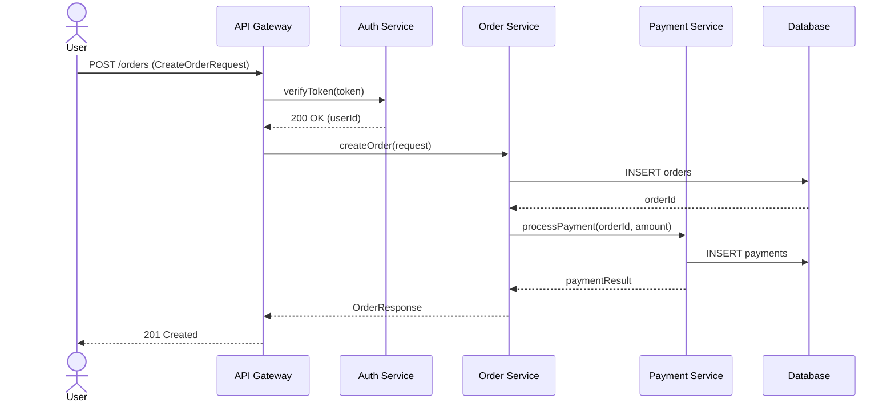
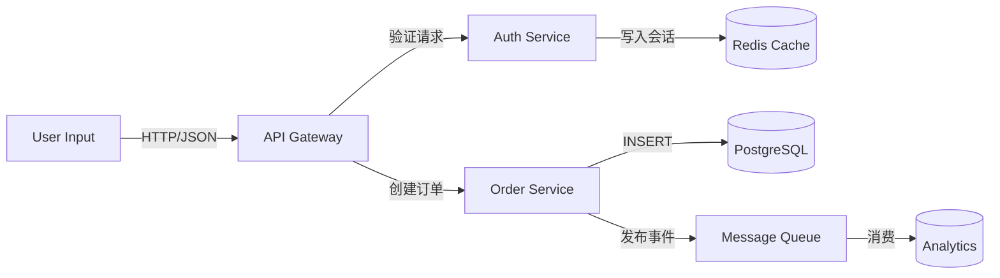
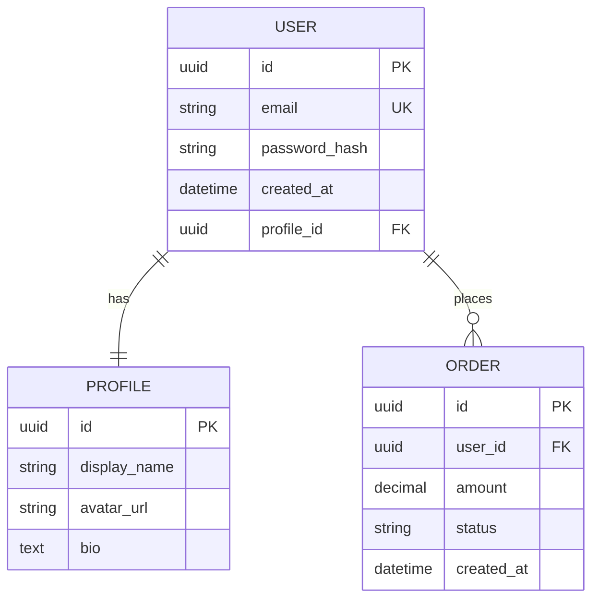

# DevForge Visualization 流程深度分析

> 基于 DevForge SDLC Skill Chain v1.4 的 `devforge-visualization/SKILL.md` 及其关联工具规范文档进行系统性分析。
>
> **定位**：架构可视化 Skill，负责将 `architecture.xml` 中的结构化架构数据转换为人类可读的 Mermaid 图表。

---

## 一、定位与核心区别

### 1.1 Skill 定位

`devforge-visualization` 是 DevForge SDLC Skill Chain 中专门负责**架构可视化**的独立 Skill。它的唯一职责是：**将已批准的 `architecture.xml` 解析为 Mermaid 语法图表**，不产生任何架构决策，不修改任何架构设计，只做"结构化数据 → 可视化表达"的转换。

与其他技能的关系：

| 维度 | `devforge-architecture-design` | `devforge-architecture-validation` | `devforge-visualization` |
|------|------------------------------|-----------------------------------|-------------------------|
| **职责** | 设计架构并生成 `architecture.xml` | 验证架构的一致性和正确性 | **将 XML 转换为图表** |
| **输出** | `architecture.xml` + `ARCHITECTURE.md` | `VALIDATION_REPORT.md` | **4 张 Mermaid 图表** |
| **是否修改架构** | 是 | 否（只检查） | **否（只读取）** |
| **产出性质** | 设计产物 | 验证报告 | **可视化产物** |
| **是否必经** | 是 | 是（默认） | **否（可选）** |

### 1.2 为什么需要独立的可视化 Skill

> **设计意图**：
> 1. **关注点分离**：架构设计、架构验证、架构可视化是三个独立职责。将可视化独立出来，可以让架构师在设计阶段专注于设计，在需要时再生成图表
> 2. **可重复触发**：可视化可以在任何时候重新生成（如架构更新后），无需重新运行设计或验证流程
> 3. **多角色价值**：不同角色需要不同的视图——产品经理需要系统上下文图，后端开发需要模块交互时序图，DBA 需要 ER 图
> 4. **XML as Authority 的可视化体现**：VCMF 原则要求"XML 是权威"。可视化是验证 XML 是否完整、准确的最直观方式——如果 XML 缺少某个模块的接口定义，图表上会立即出现"孤立节点"

### 1.3 与其他可视化的区别

| 工具/方式 | `devforge-visualization` | 传统手绘架构图 | 自动代码分析工具（如 PlantUML） |
|-----------|-------------------------|----------------|------------------------------|
| **数据源** | `architecture.xml`（设计阶段产出） | 人工绘制 | 源代码反向生成 |
| **准确性** | 与 XML 100% 一致（机器转换） | 依赖绘图者记忆，易过时 | 反映实现而非设计意图 |
| **更新方式** | 重新运行 Skill 即可 | 手动修改 | 重新扫描代码 |
| **表达层级** | 系统级 + 模块级 + 数据级 | 任意 | 通常只有类图/时序图 |
| **适用阶段** | 设计完成后任意时间 | 任意 | 编码完成后 |

**关键区别**：`devforge-visualization` 是**设计意图的可视化**，不是**实现代码的可视化**。它展示的是"系统应该如何工作"，而不是"代码实际怎么写"。这与 DIVE 循环中的 **Visualize** 阶段定位一致——在 Design 之后、Implement 之前，用可视化方式确认设计意图。

---

## 二、触发条件与前置检查

### 2.1 触发条件

| 触发方式 | 场景 | 说明 |
|----------|------|------|
| **用户输入 `[VISUALIZE]`** | 架构设计完成后，用户想看架构图 | 最常见的触发方式 |
| **自然语言触发** | 用户说 "generate architecture diagrams" 或 "生成架构图" | Skill 描述中定义的关键词匹配 |
| **架构更新后重新生成** | `architecture.xml` 发生变更后 | 可多次触发，每次都重新生成全部图表 |

### 2.2 前置条件校验

根据 `skill/tools/precondition-checker.md`：

| 校验项 | 要求 |
|--------|------|
| **Acceptable Phases** | `architecture_design_completed`, `architecture_validated`, `design_review_completed`, `scaffolding_completed`, `module_design_completed` |
| **Minimum Phase** | `architecture_design_completed` |
| **Required Artifact** | `architecture.xml` |

**不满足条件时的行为**：
- 如果阶段早于 `architecture_design_completed` → 停止执行，提示用户先完成 `devforge-architecture-design`
- 如果 `architecture.xml` 不存在 → 停止执行，提示用户先完成系统级架构设计

### 2.3 为什么不要求更晚的阶段

> **设计意图**：`devforge-visualization` 只需要 `architecture.xml` 作为输入，不需要代码、测试、或任何后续阶段的产物。因此只要架构设计完成（`architecture_design_completed`），就可以随时触发可视化。这意味着：
> - 可以在架构验证前生成初版图表，帮助架构师发现设计中的明显问题（如孤立模块）
> - 可以在设计审查后重新生成，反映审查后的修改
> - 可以在模块设计完成后重新生成，此时如果有 module-level XML 可用，图表可以更丰富

---

## 三、输出产物

`devforge-visualization` 生成 4 张 Mermaid 语法图表文件：

| 产物文件 | 路径 | 图表类型 | Mermaid 语法 | 用途 |
|----------|------|----------|-------------|------|
| `system-context.mmd` | `docs/architecture/diagrams/` | 系统上下文图 | `graph TD` | 展示系统与外部 Actor、外部系统的交互关系 |
| `module-interaction.mmd` | `docs/architecture/diagrams/` | 模块交互时序图 | `sequenceDiagram` | 展示核心用户故事的模块间调用链 |
| `data-flow.mmd` | `docs/architecture/diagrams/` | 数据流图 | `graph LR` | 展示数据在模块间的流转、转换和存储 |
| `er-diagram.mmd` | `docs/architecture/diagrams/` | ER 图 | `erDiagram` | 展示数据模型实体、字段和关系 |

### 3.1 为什么生成 4 种图表

> **设计意图**：单一图表无法完整表达软件架构的多维信息。4 种图表分别覆盖架构的 4 个核心维度：
>
> | 图表 | 回答的问题 | 面向角色 |
> |------|-----------|----------|
> | **系统上下文图** | "系统与谁交互？" | 产品经理、业务方、新团队成员 |
> | **模块交互时序图** | "模块如何协作完成一个功能？" | 后端开发、架构师 |
> | **数据流图** | "数据从哪里来？到哪里去？谁拥有它？" | DBA、数据工程师、安全审计 |
> | **ER 图** | "数据如何存储？实体之间什么关系？" | DBA、后端开发 |
>
> 这 4 种图表覆盖了 [C4 Model](https://c4model.com/) 中的 Level 1（System Context）和 Level 2（Container/Component）的部分视图，加上数据视角（Data Flow + ER）。

### 3.2 为什么使用 Mermaid 语法

> **设计意图**：
> 1. **Markdown 原生支持**：Mermaid 是 Markdown 的标准图表语法，GitHub、GitLab、Notion、Obsidian 等主流工具都支持直接渲染
> 2. **文本化**：Mermaid 是纯文本格式，可以纳入版本控制（Git diff 可比较），而图片二进制文件无法 diff
> 3. **AI 友好**：LLM 生成和理解文本格式比生成图片更可靠
> 4. **零依赖**：不需要安装 Graphviz、PlantUML 服务器等外部工具
> 5. **渲染轻量**：浏览器端即可渲染，无需后端服务

---

## 四、完整工作流程

`devforge-visualization` 的工作流程分为 8 个步骤：

```
Step 1: 解析 architecture XML
    → 读取 system-level XML + module-level XMLs
    → 构建内部图模型（modules, couplings, interfaces, data models）

Step 2: 生成系统上下文图 (system-context.mmd)
    → 节点：User, External Systems, Modules
    → 边：API calls, data flows, event streams

Step 3: 生成模块交互时序图 (module-interaction.mmd)
    → 选择一个核心用户故事
    → 模块 = participant，接口方法 = message arrow

Step 4: 生成数据流图 (data-flow.mmd)
    → 节点：Data sources, Modules, Storage, External sinks
    → 边：Data transformations, CRUD operations
    → 高亮：state ownership (who writes, who reads)

Step 5: 生成 ER 图 (er-diagram.mmd)
    → 实体 = DataModel，关系 = Relationships
    → 包含主键标记和 cardinality

Step 6: 一致性检查
    → 验证图表中的每个模块/接口/实体都在 XML 中有对应

Step 7: 状态更新
    → 更新 STATE.md（追加 Completed Steps，不转换 phase）

Step 8: 人工门控
    → 呈现图表摘要，等待用户确认
```

---

### Step 1: 解析 architecture XML

**输入文件**：
- `PROJECT_SCAFFOLD/docs/architecture/system/architecture.xml`（必需）
- `modules/{id}/module-architecture.xml`（可选，如果存在则读取）

**解析目标**：

| XML 节点 | 解析为图表元素 | 用途 |
|----------|---------------|------|
| `SystemArchitecture/Module/@id` | 模块节点 | 系统上下文图、时序图、数据流图 |
| `SystemArchitecture/Module/Interface/Input` | 接口输入定义 | 时序图消息参数 |
| `SystemArchitecture/Module/Interface/Output` | 接口输出定义 | 时序图返回类型 |
| `SystemArchitecture/Module/Coupling/DependsOn` | 模块间依赖边 | 系统上下文图边、数据流图边 |
| `SystemArchitecture/DataModel` | ER 图实体 | ER 图 |
| `SystemArchitecture/DataModel/Fields/Field` | 实体字段 | ER 图字段列表 |
| `SystemArchitecture/DataModel/Relationships/Relationship` | 实体关系 | ER 图关系线 |
| `SystemArchitecture/StateModel/State` | 状态节点 | 数据流图（标注 owner/consumer） |
| `SystemArchitecture/Security/Authentication` | 认证方式标注 | 系统上下文图（安全标注） |

**为什么需要解析 module-level XML**：
> module-architecture.xml 包含更详细的组件分解信息（Components、ComponentInterfaces）。如果存在，可视化可以更细致地展示模块内部的组件交互。但由于 visualization 的核心目标是系统级视图，module-level XML 是可选的增强信息。

---

### Step 2: 生成系统上下文图

**输出文件**：`docs/architecture/diagrams/system-context.mmd`

**Mermaid 语法**：`graph TD`（Top-Down 流程图）

**节点类型映射**：

| XML 来源 | 图表节点样式 | Mermaid 语法示例 |
|----------|-------------|-----------------|
| 外部用户/Actor | 圆形（Actor） | `actor User` |
| `Module` | 矩形（模块） | `ModuleA[模块A]` |
| 外部系统（从 `Coupling/DependsOn` 推断） | 云形（外部系统） | `ExtSystem((外部系统))` |

**边类型映射**：

| XML 来源 | 边含义 | Mermaid 语法示例 |
|----------|--------|-----------------|
| `Module/Interface` | API 调用 | `User -->|"调用 API"| ModuleA` |
| `Coupling/DependsOn` | 模块依赖 | `ModuleA -->|"依赖"| ModuleB` |
| `StateModel/State`（跨模块消费） | 数据流 | `ModuleA -->|"写入数据"| Database` |

**示例输出**：

```mermaid
graph TD
    actor User
    subgraph 系统边界
        API[API Gateway]
        Auth[Auth Service]
        Order[Order Service]
        Pay[Payment Service]
    end
    ExtPay((Payment Provider))
    DB[(Database)]

    User -->|"登录请求"| API
    API -->|"认证"| Auth
    API -->|"创建订单"| Order
    Order -->|"处理支付"| Pay
    Pay -->|"调用"| ExtPay
    Order -->|"读写"| DB
    Auth -->|"读写"| DB
```

**设计要点**：
- 用 `subgraph` 包裹所有系统内部模块，清晰表达系统边界
- 外部系统使用不同形状（云形/圆形），与内部模块区分
- 边上标注来自 `Interface` 的方法名或 `Coupling/@reason`

---

### Step 3: 生成模块交互时序图

**输出文件**：`docs/architecture/diagrams/module-interaction.mmd`

**Mermaid 语法**：`sequenceDiagram`

**选择核心用户故事**：
> 从 PRD 中选择一个核心用户故事（如"用户下单"），追踪该故事涉及的所有模块交互。为什么选择"一个"核心故事而非全部？
> - 时序图如果包含所有可能的交互，会变得极其复杂且难以阅读
> - 选择最核心的用户故事可以展示最典型的调用链
> - 如果需要多个用户故事的时序图，用户可以多次触发并指定不同故事

**参与者映射**：
- 每个 `Module/@id` = 一个 `participant`
- 外部 Actor（User）= `actor User`
- 外部系统 = `participant ExtSystem`

**消息映射**：
- 每个 `Interface` 方法调用 = 一条消息箭头
- 同步调用：`->>`（实线箭头）
- 异步调用：`->>+`（带激活条）
- 返回：`-->>`（虚线箭头）

**包含路径**：
- 正常路径（happy path）
- 认证检查（如果 `Interface` 包含 `Authentication`）
- 错误响应（如果 `ErrorCodes` 定义了错误码）

**示例输出**：



---

### Step 4: 生成数据流图

**输出文件**：`docs/architecture/diagrams/data-flow.mmd`

**Mermaid 语法**：`graph LR`（Left-Right 流程图）

**节点映射**：

| 数据源 | 图表节点样式 | 示例 |
|--------|-------------|------|
| 外部数据源 | 圆柱形（数据库） | `DS[(外部数据源)]` |
| `Module` | 矩形 | `Module[模块]` |
| `StateModel/State/@location` | 存储系统 | `PG[(PostgreSQL)]`, `Redis[(Redis)]` |
| 外部 Sink | 云形 | `Analytics((分析平台))` |

**边映射**：
- `StateModel/State/@owner` → 谁写入（实线箭头）
- `StateModel/State/@consumer` → 谁读取（虚线箭头）
- `DataModel` 的转换关系 → 标注转换操作（CREATE / READ / UPDATE / DELETE）

**高亮设计——State Ownership**：
> 数据流图的核心价值之一是展示"谁拥有数据"。`StateModel` 中的 `owner` 和 `consumer` 属性直接映射到数据流图中的箭头方向：
> - `owner` 模块 → 指向存储的实线箭头（写入）
> - `consumer` 模块 → 从存储出发的虚线箭头（读取）
> 这种可视化直接回答了微服务架构中最关键的问题之一："这个数据属于哪个服务？"

**示例输出**：



---

### Step 5: 生成 ER 图

**输出文件**：`docs/architecture/diagrams/er-diagram.mmd`

**Mermaid 语法**：`erDiagram`

**实体映射**：
- 每个 `DataModel/@name` = 一个 `erDiagram` 实体
- `DataModel/Fields/Field/@name` + `@type` = 实体字段
- `Field/@primaryKey="true"` = 主键标记（PK）
- `Field/@required="true"` = NOT NULL 标记

**关系映射**：
- `Relationships/Relationship` = 关系线
- `@type`（one-to-one / one-to-many / many-to-many）= Mermaid ER 关系语法
- `@foreignKey` = 外键字段

**Mermaid ER 关系语法**：

| Relationship Type | Mermaid Syntax | 含义 |
|-------------------|---------------|------|
| one-to-one | `||--||` | 一对一 |
| one-to-many | `||--o{` | 一对多 |
| many-to-many | `}o--o{` | 多对多 |

**示例输出**：



**设计要点**：
- 主键标记为 `PK`
- 外键标记为 `FK`
- 唯一约束标记为 `UK`（如果适用）
- 关系线上标注语义（如 `"has"`, `"places"`）

---

### Step 6: 一致性检查

**为什么需要一致性检查**：
> Visualization 的核心原则是"XML 是权威"，图表必须 100% 反映 XML 内容，不能有任何 invented 元素。一致性检查确保：
> 1. 图表中展示的每个模块都在 `architecture.xml` 中有定义
> 2. 时序图中的每个接口调用都在 `INTERFACE_CONTRACT.md` 中有定义
> 3. ER 图中的每个实体都在 `DataModel` 中有定义
>
> 如果检查失败，说明 XML 和图表之间存在不一致，需要修复（通常是 XML 缺失或图表生成逻辑有误）。

**检查项**：

| 检查项 | 验证内容 | 失败时的行为 |
|--------|----------|-------------|
| **模块一致性** | 图表中的模块 ID 是否都存在于 `architecture.xml/Module/@id` | 标记错误，在报告中指出"图表包含 XML 中不存在的模块" |
| **接口一致性** | 时序图中的接口方法是否存在于 `INTERFACE_CONTRACT.md` | 标记警告，指出未定义的接口调用 |
| **实体一致性** | ER 图中的实体名是否存在于 `DataModel/@name` | 标记错误 |
| **关系一致性** | ER 图中的关系是否存在于 `Relationships/Relationship` | 标记错误 |

---

### Step 7: 状态更新

根据 `skill/tools/state-updater.md`：

- **不转换 phase**：`devforge-visualization` 不改变当前阶段（它是一个可选的辅助步骤，不影响主流程）
- **追加到 Completed Steps**：记录本次可视化操作
- **不修改其他 STATE.md 章节**

---

### Step 8: 人工门控

**呈现内容**：
- 图表摘要："已生成 4 张架构图：系统上下文图、模块交互时序图、数据流图、ER 图。请确认当前阶段输出。"

**可用命令**：

| 命令 | 行为 |
|------|------|
| `[APPROVE]` | 标记可视化阶段完成 |
| `[PAUSE]` | 暂停当前阶段，保留上下文 |
| `[ROLLBACK {step_id}]` | 回滚到指定步骤重新执行 |
| `[EDIT {file_path}]` | 手动编辑图表文件后让 AI 继续 |
| `[INJECT {context}]` | 补充额外上下文约束 |
| `[SKIP]` | 跳过当前可选步骤 |
| `[EXPLAIN {TraceID}]` | 展开解释某个决策/错误的推理链 |

**自然语言反馈处理**：
> 如果用户输入自然语言（如"系统上下文图里少了缓存模块"），Skill 不将其视为无效命令，而是：
> 1. 分析用户意图（"缓存模块"可能指 Redis 或 Memcached）
> 2. 检查 `architecture.xml` 中是否确实存在该模块但图表遗漏了
> 3. 如果是遗漏 → 重新生成对应图表
> 4. 重新呈现门控

---

## 五、调用工具汇总

| 工具 | 用途 | 调用时机 |
|------|------|----------|
| `Read` | 读取 `architecture.xml` | Step 1 |
| `Read` | 读取 `INTERFACE_CONTRACT.md` | Step 3（接口验证） |
| `Read` | 读取 `PRD.md`（选择核心用户故事） | Step 3 |
| `Read` | 读取 module-level XMLs | Step 1（可选增强） |
| `Write` | 写入 `system-context.mmd` | Step 2 |
| `Write` | 写入 `module-interaction.mmd` | Step 3 |
| `Write` | 写入 `data-flow.mmd` | Step 4 |
| `Write` | 写入 `er-diagram.mmd` | Step 5 |
| `Grep` | 一致性检查（验证图表元素存在于 XML） | Step 6 |

---

## 六、生成产物清单

| 产物文件 | 路径 | 用途 | 更新模式 |
|----------|------|------|----------|
| `system-context.mmd` | `docs/architecture/diagrams/` | 系统上下文图 | 新生成（可覆盖） |
| `module-interaction.mmd` | `docs/architecture/diagrams/` | 模块交互时序图 | 新生成（可覆盖） |
| `data-flow.mmd` | `docs/architecture/diagrams/` | 数据流图 | 新生成（可覆盖） |
| `er-diagram.mmd` | `docs/architecture/diagrams/` | ER 图 | 新生成（可覆盖） |
| `STATE.md` Completed Steps | `docs/architecture/system/` | 记录可视化操作 | Append-only |

### 6.1 产物更新策略

可视化产物使用**覆盖模式**（Overlay）：
- 每次触发重新生成时，直接覆盖旧的 `.mmd` 文件
- 因为图表是 XML 的"视图"，XML 更新后图表应该完全重新生成
- 如果用户手动编辑了 `.mmd` 文件，重新生成时会覆盖手动修改（用户应使用 `[EDIT]` 命令让 AI 在生成阶段就纳入修改）

---

## 七、VCMF 检查点

`devforge-visualization` 的 VCMF 检查点体现了它作为"XML 视图"的定位：

| VCMF 原则 | 检查点 | 说明 |
|-----------|--------|------|
| **Design as Contract** | 图表必须精确匹配 `architecture.xml`；不能发明模块或接口 | 可视化不是重新设计，而是忠实表达 |
| **Interface as Boundary** | 时序图消息必须匹配 `Interface` 定义 | 接口契约在图表中可见 |
| **Reality as Baseline** | ER 图关系必须有 `Relationships` 节点或 `Coupling` 支持 | 不画不存在的关联 |
| **State as Responsibility** | 数据流图必须展示状态所有权（谁写谁读） | `StateModel` 的可视化体现 |
| **XML as Authority** | 所有图表元素必须可通过唯一 ID 在 `architecture.xml` 中验证 | 一致性检查的核心 |

---

## 八、流程设计原理（Why Designed This Way）

### 8.1 为什么是可选步骤而非必经

| 对比 | 必经（如 architecture-design） | 可选（如 visualization） |
|------|------------------------------|--------------------------|
| **适用场景** | 所有项目 | 需要文档/沟通的项目 |
| **执行成本** | 必须承担 | 按需执行 |
| **核心价值** | 设计产物 | **沟通辅助** |

> **设计意图**：并非所有项目都需要正式的可视化图表。例如：
> - 个人原型项目可能不需要架构图
> - 已有成熟架构图的遗留系统不需要重新生成
> - 但团队协作项目、需要文档审计的项目、新成员 onboarding 场景都强烈建议生成

### 8.2 为什么使用 Mermaid 而非图片格式

| 特性 | Mermaid | PNG/JPG | PlantUML |
|------|---------|---------|----------|
| **Git diff** | ✅ 文本可 diff | ❌ 二进制 | ✅ 文本 |
| **GitHub 渲染** | ✅ 原生支持 | ❌ 需上传 | ❌ 需服务器 |
| **LLM 生成** | ✅ 高可靠 | ❌ 需工具 | ✅ 中等 |
| **手动编辑** | ✅ 可直接修改 | ❌ 需重绘 | ✅ 可以 |
| **嵌入文档** | ✅ Markdown 原生 | ❌ 需链接 | ❌ 需转换 |

> **设计意图**：选择 Mermaid 是为了让可视化产物成为"活的文档"——纳入版本控制、可 diff、可手动微调、可在任何 Markdown 阅读器中渲染。

### 8.3 为什么生成 4 种图表而非 1 种综合图

> **设计意图**：
> - **单一综合图的困境**：试图在一张图中展示所有信息会导致"意大利面条"式图表，无法阅读
> - **分维度可视化的优势**：每种图表聚焦一个架构维度，保持清晰和可读性
> - **角色匹配**：不同角色需要不同图表（产品经理看上下文图，DBA 看 ER 图）
> - **C4 Model 启发**：Simon Brown 的 C4 Model 已经证明，软件架构需要多层视图才能有效沟通

### 8.4 为什么一致性检查是必要步骤

> **设计意图**：
> 可视化最大的风险是"图表与代码/设计不同步"——这是软件文档的经典问题。通过在生成后运行一致性检查：
> 1. **防止 invented 元素**：确保 AI 没有在图表中"脑补"不存在的模块
> 2. **早期发现 XML 缺失**：如果图表中应该有的元素在 XML 中找不到，可能是 XML 遗漏了
> 3. **建立信任**：用户知道图表是 XML 的精确映射，可以放心使用

### 8.5 为什么 module-level XML 是可选而非必需

> **设计意图**：
> `devforge-visualization` 的核心价值在系统级视图。module-level XML 包含组件级分解（Components、ComponentInterfaces），如果存在可以丰富图表细节（如模块内部的组件交互）。但：
> - 不是所有项目都会生成 module-level XML（小型项目可能只有 system-level）
> - 即使只有 system-level XML，4 种图表仍然有价值
> - 将 module-level XML 设为可选，降低了 visualization 的触发门槛

---

## 九、常见误区与 Red Flags

### 9.1 与 `architecture-design` 的边界误区

| 误区 | 正确做法 |
|------|----------|
| 在 visualization 阶段"修正"架构设计 | `devforge-visualization` **不修改** `architecture.xml`，如果发现 XML 有问题，应回滚到 `architecture-design` 修复 |
| 在图表中发明 XML 中不存在的模块 | 所有图表元素必须可通过一致性检查 |
| 认为图表可以替代 XML 作为权威 | XML 是权威，图表只是视图。如果图表和 XML 冲突，以 XML 为准 |

### 9.2 通用误区

| 误区 | 正确做法 |
|------|----------|
| 手动编辑 `.mmd` 文件后期望保留 | 手动修改会被下次重新生成覆盖。应使用 `[EDIT]` 命令让 AI 在生成时纳入修改 |
| 认为可视化只在架构设计后做一次 | 每次 `architecture.xml` 更新后都应重新生成，保持图表同步 |
| 将 Mermaid 图表导出为图片后丢弃源文件 | `.mmd` 源文件是版本控制的对象，图片只是渲染结果 |
| 在时序图中试图展示所有用户故事 | 选择一个核心故事即可，展示所有故事会导致图表不可读 |
| 忽略数据流图的 state ownership | 数据流图的核心价值之一就是展示数据所有权，不应省略 |
| 为小型系统生成过度复杂的图表 | 如果系统只有 2-3 个模块，系统上下文图和时序图可能合并为一张 |

### 9.3 SKILL.md 中的 Red Flags

SKILL.md 明确定义了以下红线：

| Red Flag | 说明 |
|----------|------|
| **Do NOT invent modules not in `architecture.xml`** | 禁止发明 XML 中不存在的模块 |
| **Do NOT draw interfaces not in `INTERFACE_CONTRACT.md`** | 禁止绘制未定义的接口 |
| **Do NOT generate diagrams if `architecture.xml` is missing or unapproved** | 没有 XML 时不生成图表 |

---

## 十、总结

`devforge-visualization` 是 DevForge SDLC Skill Chain 中的**架构可视化转换器**——它将机器友好的结构化 XML 转换为人类友好的可视化图表。

### 核心价值

1. **XML as Authority 的可视化体现**：图表不是独立的设计产物，而是 XML 的精确视图。这确保了"设计即文档、文档即图表"的一致性
2. **沟通桥梁**：将技术性的 XML 架构转换为非技术人员也能理解的图表，降低架构沟通成本
3. **可重复生成**：架构更新后随时重新生成，避免图表过时的经典问题
4. **多维度视图**：4 种图表覆盖架构的 4 个核心维度，满足不同角色的信息需求
5. **版本控制友好**：Mermaid 纯文本格式可纳入 Git，diff 可见

### 适用场景

| 场景 | 推荐操作 |
|------|----------|
| 架构设计完成后首次可视化 | 触发 `[VISUALIZE]` 生成初始图表 |
| 设计审查后发现架构问题并修改后 | 重新触发 `[VISUALIZE]` 更新图表 |
| 模块设计完成后 | 重新触发，此时 module-level XML 可能丰富图表细节 |
| 新团队成员 onboarding | 提供 4 张图表帮助快速理解系统架构 |
| 向业务方/管理层汇报 | 使用系统上下文图展示系统边界和外部依赖 |
| 安全审计 | 使用数据流图展示数据所有权和流转路径 |

### 与其他技能的协作

```
architecture-design (生成 architecture.xml)
    ↓
architecture-validation (验证 XML 正确性)
    ↓
design-review (对抗性审查设计)
    ↓
[VISUALIZE] → devforge-visualization (将 XML 转为图表)
    ↓
project-scaffolding / module-design (基于图表理解进行实现)
```

### v1.2 设计决策

`devforge-visualization` 是在 v1.2 中引入的，其设计背景是：
- v1.1 建立了三层 XML 架构权威（System/Module/Component）
- v1.2 需要一种方式让这些 XML"可见"——即转换为人类可读的图表
- Mermaid 被选为图表语法，因为它与 Markdown 原生集成，适合 AI 生成

---

*分析基于 DevForge SDLC Skill Chain v1.4（2026-05-11）及 devforge-visualization v1.2*
